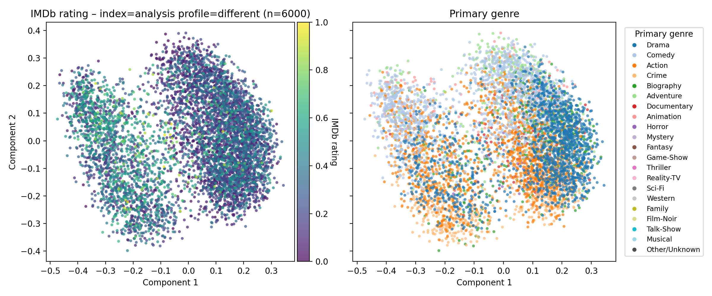
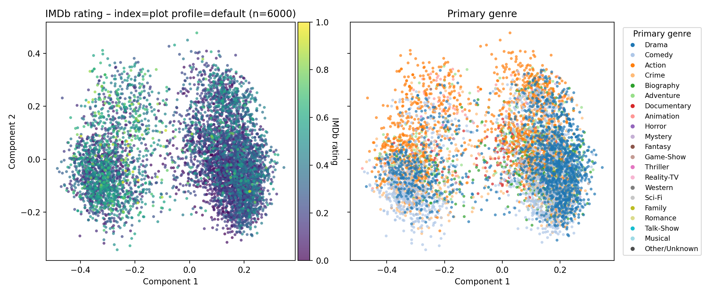

# Movie Recommending Pipeline

Instead of doing the usual wikipedia plot summary -> embeddings -> cosine similarity, we do:

- filter movies and tv series first for convenience, currently > 6.0 imdb rating and > 10000 votes (this is 11.7k movies and tv shows as of today)
- get their wikipedia plot summaries and descriptions
- use grok-4-fast-reasoning and have it TRY ITS BEST to generate why a movie is compelling based on the wikipedia data only as a starting point to keep hallucination minimal
- this is important - wikipedia plot summaries are not perfect for why a movie is compelling to watch - there are many other things. Take Blade Runner 2049 as an example. The plot summary is almost useless for why this movie is cool. this is why we need grok - it adds all these additional aspects for why one might like a movie
- we run this for all the 11.7k movies and tv shows - lol.
- then we take the grok texts and embed them (OpenAI `text-embedding-3-large` by default, but you can swap in local models like Qwen's 4B embedder)

and boom - hopefully we now have a better recommender than the naive version.


## Plots
Here is the plot for the 6000 highest rated movies and tv shows, using the embeddings from the system_different.txt prompt - the two big clusters are movies and tv shows. 




Interstingly, the clustering looks a bit different when just using the "naive" method of simply converting wikipedia descriptions + plot -> embeddings





## Results

Qualitatively, I think the Grok analyses embeddings are quite a bit better at recommending, and also often catch much more interesting connections. For example:

### House (2004)

#### With Grok Analyses (top 10 most similar)

```
1.0000 | House (2004) — IMDb 8.7
0.8183 | The Resident (2018) — IMDb 7.8
0.8031 | Sherlock (2010) — IMDb 9.0
0.7816 | Elementary (2012) — IMDb 7.9
0.7813 | The Good Doctor (2017) — IMDb 8.0
0.7713 | Grey's Anatomy (2005) — IMDb 7.6
0.7705 | Bones (2005) — IMDb 7.8
0.7671 | Code Black (2015) — IMDb 8.0
0.7659 | Scrubs (2001) — IMDb 8.4
0.7658 | Chance (2016) — IMDb 7.5
```

#### With Wikipedia Plot Embeddings (top 10 most similar)

```
1.0000 | House (2004) — IMDb 8.7
0.6898 | Grey's Anatomy (2005) — IMDb 7.6
0.6763 | The Big C (2010) — IMDb 8.1
0.6530 | Mom (2013) — IMDb 7.4
0.6443 | Californication (2007) — IMDb 8.3
0.6387 | Desperate Housewives (2004) — IMDb 7.6
0.6359 | House of Lies (2012) — IMDb 7.4
0.6308 | Scrubs (2001) — IMDb 8.4
0.6242 | NYPD Blue (1993) — IMDb 7.8
0.6239 | Hill Street Blues (1981) — IMDb 8.2
```

I have watched almost none of these, so I can't speak to how accurate these are, but simply based off vibes, it seems that the analysis version is a lot better—the plot version puts Grey's Anatomy at the number 2 spot, which seems off.

It seems to just get generic medical TV shows and clumps them together, which is fine but not perfect.

One of my favorite matches so far for the analysis version—and why I bring up this comparison—is that it ranks "Sherlock" so highly as a match for House. The main characters and why the shows are compelling to watch are very close, I think.

### Another Example: Blade Runner 2049 (2017)

The plot recommendations are sometimes a bit random and generic, but the Grok version gets the vibe totally right—I think the coolest pick is that it finds "Her". Again, I haven't watched most of these, but I assume it's pretty good.

#### With Grok Analyses (top 10 most similar)

```
1.0000 | Blade Runner 2049 (2017) — IMDb 8.0
0.9182 | Blade Runner (1982) — IMDb 8.1
0.8193 | Solaris (1972) — IMDb 7.9
0.8127 | Her (2013) — IMDb 8.0
0.8093 | Dune: Part One (2021) — IMDb 8.0
0.8086 | Ghost in the Shell 2: Innocence (2004) — IMDb 7.4
0.8073 | Ghost in the Shell 2.0 (2008) — IMDb 7.8
0.8051 | Ghost in the Shell (1995) — IMDb 7.9
0.8035 | A.I. Artificial Intelligence (2001) — IMDb 7.2
0.7992 | Arrival (2016) — IMDb 7.9
```

#### With Wikipedia Plot Embeddings (top 10 most similar)

```
1.0000 | Blade Runner 2049 (2017) — IMDb 8.0
0.8550 | Blade Runner (1982) — IMDb 8.1
0.6396 | Aliens (1986) — IMDb 8.4
0.6245 | Alien: Romulus (2024) — IMDb 7.1
0.6205 | Terminator 2: Judgment Day (1991) — IMDb 8.6
0.6200 | Alita: Battle Angel (2019) — IMDb 7.3
0.6119 | Alien (1979) — IMDb 8.5
0.6114 | Star Wars: Episode VII - The Force Awakens (2015) — IMDb 7.7
0.6088 | Minority Report (2002) — IMDb 7.6
0.6084 | Ghost in the Shell 2.0 (2008) — IMDb 7.8
```

The grok version has many other cool examples like this where it gets some non obvious recommendation REALLY right.

## Thoughts

How well the recommendation system works is likely highly dependent on the quality of the grok texts. so better prompt - better embeddings.
The system prompt can probably be refined a lot and engineered by how it affects the output for a certain movie after each refinement.
To give you an idea of how the current output looks (for system_different.txt), look at example_grok_output.txt - this is for Blade Runner 2049.

Running grok through 11.7k movies is crazy. Intelligence is so cheap now that you can just brute force. One pass costs around $11. lol. you can even get this further down if you try to make it less verbose, but im not sure how that will affect recommendation quality - it could even go up!

Also funny, this entire project was writtien by codex-cli with gpt-5-codex - idea to final version was maybe a day, but actual implementation maybe a few hours.


## Highlights
- **Ingestion** – `fetch-imdb` downloads the official IMDb TSV snapshots and writes a filtered manifest into SQLite.
- **Plot harvesting** – `fetch-plots` maps titles to Wikipedia pages, cleans the text, and stores both raw and cleaned plots.
- **LLM enrichment** – `run-analysis` calls Grok (xAI) to produce rich per-title analyses, tracking usage and status per profile.
- **Embeddings** – `compute-embeddings` (and `compute-plot-embeddings`) now support OpenAI or local `sentence-transformers` models, storing vectors per profile/embedding-set for easy A/B runs. This is really cool - apparently openai embeddings aren't that great anymore - qwen seem to be sota! and we can easily run them locally because they have 0.6, 4B, and 8B models.
- **Queries** – `query-text` and `query-title` surface nearest neighbours with optional analysis snippets and Grok-on-Grok explanations.
- **Visualization** – `python -m movie_pipeline.embedding_plot` renders quick 2D scatters (ratings/genre tinted) for sanity checks.

Refer to `cheat_sheet.md` for CLI examples and workflow switches (profiles, limits, force rebuilds). The `prompts/` directory contains the system prompts used during Grok runs so each profile can be versioned alongside the code.